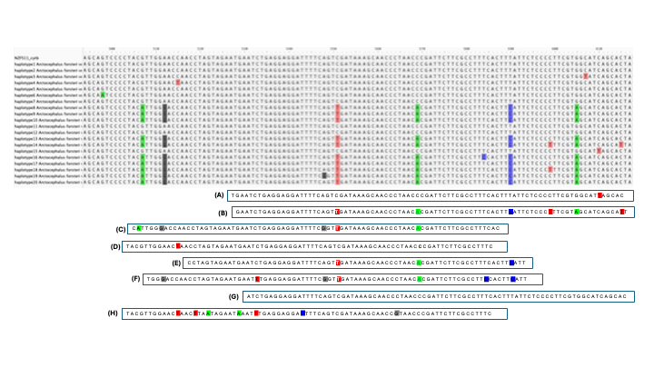

# meta_tools

A set of tools for working with metagenomic data. 

## Population genomics of fur seals 

The scripts for this project are used to determine the haplotypes of the mitogenome assemblies from an environmental bait capture experiment of New Zealand fur seals. 

### Overall strategy 

Because the assemblies are derived from environmental DNA, it is not possible to assign the entire assembly to a single haplotype, as multiple individuals could contribute to any single water sample. Therefore, the strategy I used was to assign **each sequence read** to a haplotype, as best as possible. 

The following alignment from part of the **cytB** mitochondrial gene illustrates the approach:

----------------------

This covers both amplicon/single gene metagenomics (metabarcoding), and shotgun/functional metagenomics

[**Instructions for running *find_haplotypes.py* script**](instructions/finding_haplotypes.md)

[**Instructions for running *haplotype_counts.py* script**](instructions/haplotype_counts.md)

[**Instructions for running *extractHaplotypes.py* script**](instructions/map_extract_haplotypes.md)

