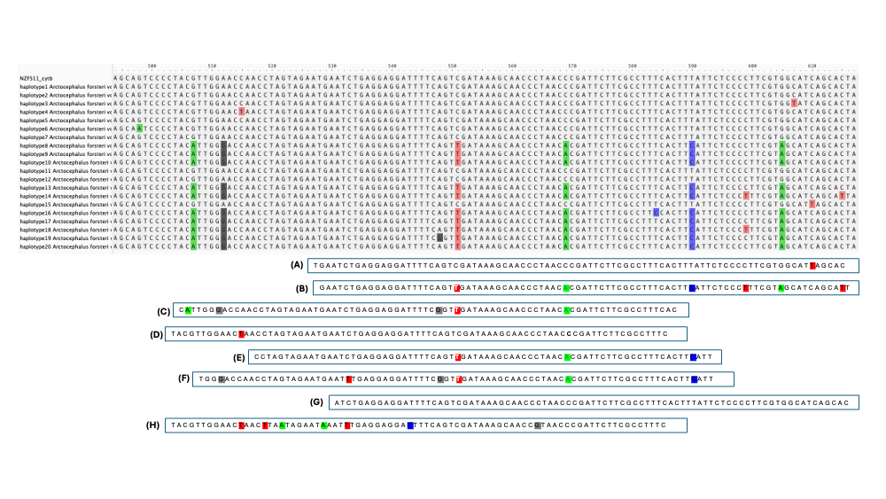

# meta_tools

A set of tools for working with metagenomic data. 

## Population genomics of fur seals 

The scripts for this project are used to determine the haplotypes of the mitogenome assemblies from an environmental bait capture experiment of New Zealand fur seals. 

### Overall strategy 

Because the assemblies are derived from environmental DNA, it is not possible to assign the entire assembly to a single haplotype, as multiple individuals could contribute to any single water sample. Therefore, the strategy I used was to assign **each sequence read** to a haplotype, as best as possible. 

The following alignment from part of the **cytB** mitochondrial gene illustrates the approach:

The alignment shows the consensus alignment of 20 **cytB** fur seal haplotypes, with reads (A) - (H) aligned below. The included scripts will assign each read to a haplotype (or haplotypes) depending on their position:

read (A) is assigned to haplotype 15

read (B) is assigned to haplotype 14

read (C) is assigned to haplotype 19

read (D) is assigned to haplotype 4

The remaining reads are less certain:

read (E) could be haplotype 8, 9, 10, 13, 17, 18, or 20

read (F) looks to be haplotype 19, but has a SNP (at position 533) that is not in any of the known haplotypes

read (G) could be haplotypes 1, 2, 3, 5, 6, 7, 11, or 12

read (H) has many SNPs not found in any of the haplotypes, and is probably sea lion or another species

----------------------

This covers both amplicon/single gene metagenomics (metabarcoding), and shotgun/functional metagenomics

[**Instructions for running *find_haplotypes.py* script**](instructions/finding_haplotypes.md)

[**Instructions for running *haplotype_counts.py* script**](instructions/haplotype_counts.md)

[**Instructions for running *extractHaplotypes.py* script**](instructions/map_extract_haplotypes.md)

